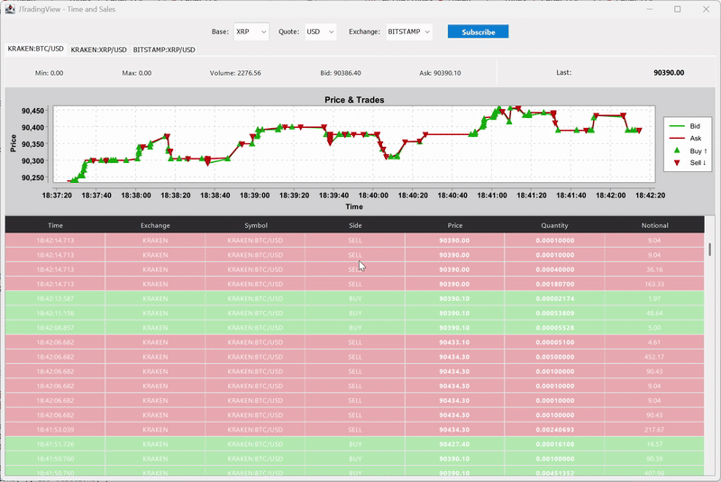

# JTradingView

A real-time cryptocurrency Time and Sales viewer built in Java/Swing that displays live trade data from multiple exchanges.

## What is Time and Sales?

Time and Sales (also known as "the tape") is a real-time display of every executed trade for a specific instrument, showing:
- **Price** - The execution price of each trade
- **Quantity** - The volume traded
- **Side** - Whether it was a buy or sell
- **Timestamp** - When the trade occurred
- **Liquidity** - Whether the order was a maker or taker

## Features

- **Multi-Exchange Support** - Connect to Binance, Kraken, Bitstamp, and Bybit simultaneously
- **Real-Time Streaming** - WebSocket-based live trade and ticker data feeds
- **Time and Sales View** - Traditional tape display with color-coded buy/sell orders
- **Price Chart** - Visual representation of recent trade activity
- **Market Statistics** - Live bid/ask spreads, volume, and price changes
- **Multiple Instruments** - Track different trading pairs in separate tabs

## Technology Stack

- **Java 15** with Swing for the GUI
- **XChange Streaming** library for exchange connectivity
- **RxJava 3** for reactive stream processing
- **SLF4J + Logback** for logging
- **Swing** for the graphical user interface

## Architecture

The application follows a clean separation of concerns:

- **Protocol Layer** - Exchange-agnostic domain models (Trade, Ticker, Instrument)
- **Streaming Layer** - Manages WebSocket connections and subscriptions to exchanges
- **Graphical Layer** - Swing-based UI components for data visualization
- **Utility Layer** - Circular buffers for efficient data storage
